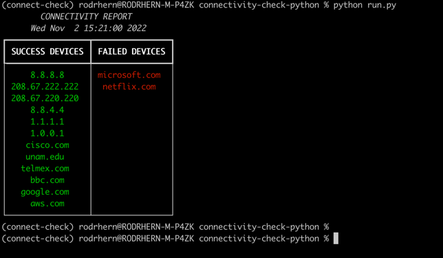

# Connectivity Check
Connectivity check using ping and python.

**NOTE:** This script is functional in any UNIX system such macOS, Ubuntu etc. Windows OS has not been test it 


## Pre-Requisites
You must have **Python3** and **pip3** installed. 
Once is done, clone this repository


## Install python dependencies
1. Open a CMD/Powershell/terminal console and move it folder `connectivity-check-python`
2. Open the file `devices.txt` and fill it with the IPs/Hostnames to check
3. Install the python dependencias that are in _requirements.txt_ file. You can use:
```
pip intall -r requirements.txt
````
## Running the script
1. Use the next command to run the script:
```
python run.py
```

